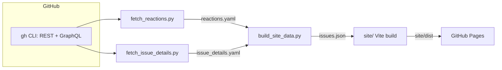

# Django New Features Dashboard

A prototype dashboard for browsing the [django/new-features](https://github.com/django/new-features)
repo. This project pulls in data GitHub scatters across separate pages
(reactions, comments, project board status) and puts it all in a single
sortable, filterable table.

Live site: https://tim-schilling.github.io/new-features-dashboard/

## Major features

- Full-text search across issue title and description
- Reactor list, and commenter list
- Filter by project status and by label (multi-select)
- Sort by reactions, reaction ratio, comment count, top commenters, and more
- Daily automated data refresh via GitHub Actions, published to GitHub Pages
- 
## What it adds beyond GitHub

- **Reaction breakdown per issue.** This shows who reacted with what.
- **Commenter breakdown.** Top commenters and full per-user comment counts
  for each issue.
- **Project board status.**
- **Searching, sorting and filtering.** Includes columns GitHub can't on such 
  as reaction ratio, comment count, top commenters.
- **Shareable views.** Search, filters, and sort are encoded in the URL, so
  a filtered view can be shared with a link.

## Contributing

The application is several Python scripts that use the `gh` CLI to fetch
data into yml files. The site itself is a Vite + TypeScript app using
[Tabulator](https://tabulator.info/) for the table.

### Local setup

```
just sync           # install Python deps
just auth-project    # grant gh the read:project scope
just pipeline         # fetch-reactions -> fetch-details -> build-data
just site-install
just site-dev         # or `just site-build`, `just site-test`
```

Run `just --list` for the full command list.

### Data flow



### Deployment

`.github/workflows/deploy.yml` runs daily and on pushes to `main` that
touch `scripts/` or `site/`. It fetches fresh data, builds the site, and
publishes to GitHub Pages. `output/` is cached per UTC day, so only the
first workflow run each day hits the GitHub API.

The workflow needs a `PROJECTS_TOKEN` repo secret, since the default
`GITHUB_TOKEN` can't read Projects (v2) data. Use a classic PAT with `repo`
and `read:project` scopes.

A fine-grained PAT scoped to just `django/new-features` (`Issues:
Read-only`, plus org permission `Projects: Read-only`) is more locked down,
but requires Ops Team approval.
